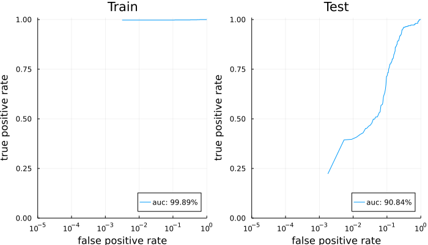

# AcuracyAtTopPdual.jl
## Instalation

```julia
(@v1.6) pkg> add https://github.com/VaclavMacha/AccuracyAtTopDual.jl
```

## Quick-start quide
### Model settings

```julia
using AccuracyAtTopDual
using DatasetProvider
using EvalMetrics
using Plots

# data preparation
T = Float32;
dataset = Dataset(
    DatasetProvider.Spambase;
    asmatrix = true,
    shuffle = true,
    binarize = true,
    poslabels = 1,
    seed = 123,
);
train, test = load(TrainTest(0.8), dataset);
Xtrain, ytrain = Array{T}(train[1]), train[2];
Xtest, ytest = Array{T}(test[1]), test[2];

# model definition
model = TopPush(; C = 1, ϑ = 1, surrogate = Quadratic, T)
kernel = KernelType(Gaussian; γ = 1, scale = true, precomputed = false, T)
```

### Training

```julia
julia> h = solve!(model, Xtrain, ytrain, kernel; maxiter = 20000, seed = 123, ε = 1e-4)
TopPush(1.0, Quadratic, 1.0): 
⋅ Initialization: 0:00:00 
⋅ Training: 100%|███████████████████████████████████████████████████████| Time: 0:00:15
  L_primal:  325.42047
  L_dual:    325.2755
  gap:       0.1449585
  iter:      14925
  stop:      9.9971374e-5
⋅ Evaluation: 0:00:00 
```

### Evaluation

```julia
s_train = h.solution[:train].s;
s_test = predict(model, Xtrain, ytrain, kernel, Xtest);

plot(
    rocplot(ytrain, s_train; title = "Train"),
    rocplot(ytest, s_test; title = "Test");
    xlims = (1e-5, 1),
    xscale = :log10,
    fill = false,
    size = (700, 400),
)
```

